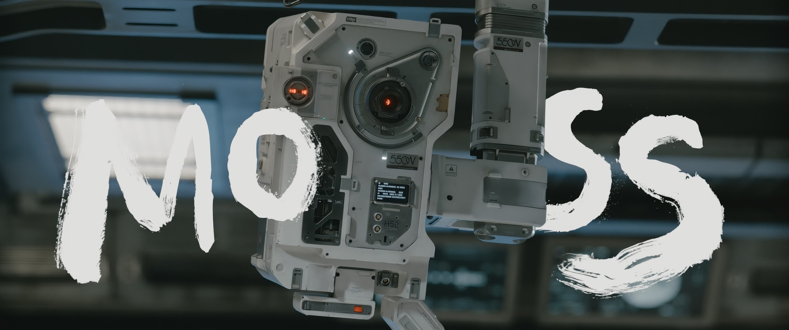

## Moss the trader (MTT)


550W, personified name "MOSS", is the latest model of 550 series quantum computer. This is a segment of 550W which focusing on trading web3 assets. We call it "Moss the trader" or MTT.

## What's unique?
This is an experiment. The development of MTT heavly involves AI such as ChatGPT. We want to know the boundaries of what is possible with AI on trading.

## Setup
1. Use your prefered pythohn virtual environment. Example `virtualenv`:
    ```bash
    # Make sure your Python is >= 3.10
    
    # If virtual env not created
    $ python3 -m venv mtt

    # Activate the virtual environment
    $ source mtt/bin/activate
    ```
2. Install dependencies
    ```bash
    $ pip install -r requirements.txt
    ```
3. Create your binance API key on Binance site.
4. Set `BINANCE_API_KEY` and `BINANCE_API_SECRET`
    ```bash
    $ export BINANCE_API_KEY=<your binance api key>
    $ export BINANCE_API_SECRET=<your binance api secret>
    ```
5. Run pre-flight check
    ```bash
    $ python3 src/preflight.py
    ```